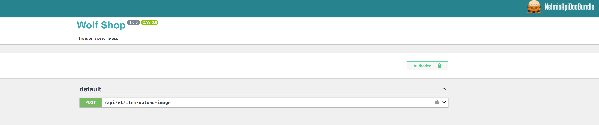
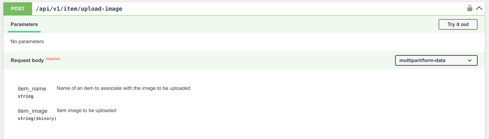
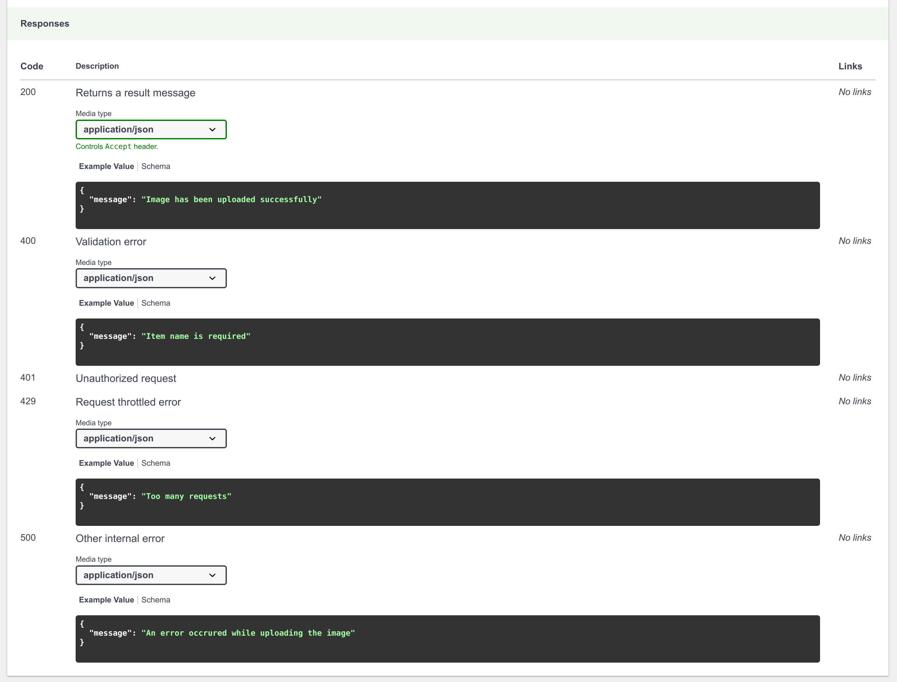
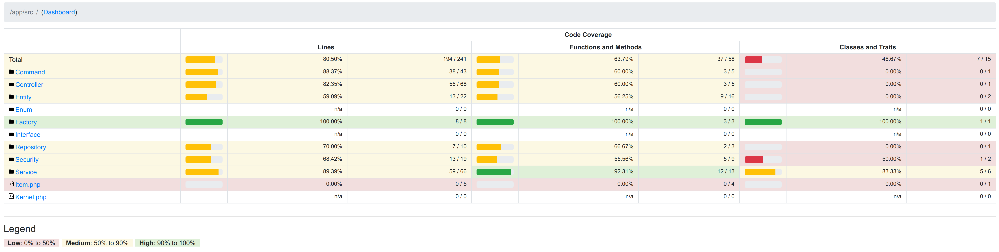
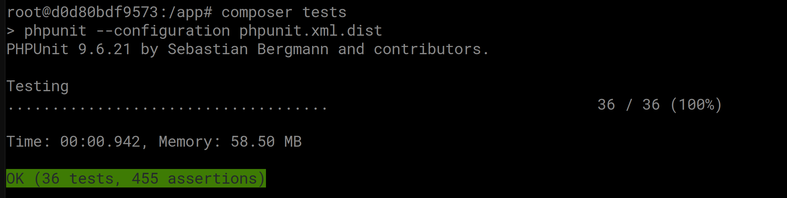

# Coding Assessment Project

## Dear evaluators
Welcome to my mini-project for the coding assessment ✨ \
Please, be my guest and have a cup of tea 🍵 with a delecious cake(s) 🍪 of your choice before diving into the following project information

## Project Techstack
This project levarages latest version of the following techstack
- `PHP` programming language - version 8.3.12
- `Symfony` framework - version 7.1.5
- `PostgreSQL` database management system - version 16.4

## Development Environment
The project also leverages the power of containerized application by providing a [Docker](https://www.docker.com/)-based installer and runtime for the Symfony web framework, with [FrankenPHP](https://frankenphp.dev/) and [Caddy](https://caddyserver.com/) inside which is based on this [Symfony Docker](https://github.com/dunglas/symfony-docker) project

### Features
- Production, development environments and CI skeleton ready
- Blazing-fast performance thanks to the worker mode of FrankenPHP (automatically enabled in prod mode)
- Installation of extra Docker Compose services with Symfony Flex
- Automatic HTTPS (in dev and prod)
- Native XDebug integration

### Getting Started
- If not already done, install [Docker Compose](https://docs.docker.com/compose/install/) (v2.10+)
- Run `docker compose up -d` to build images and start up containers for the project
- Open https://localhost in your favorite web browser and accept the auto-generated TLS certificate
- Run `docker compose down --remove-orphans` to stop the Docker containers in case of needed

💥 For more details on features usage, please check out this official [Symfony Docker](https://github.com/dunglas/symfony-docker) project which is hand-crafted by [Kévin Dunglas](https://github.com/dunglas) (Founder of [@coopTilleuls](https://github.com/coopTilleuls) / Creator of [@api-platform](https://github.com/api-platform), Mercure.rocks, FrankenPHP and Vulcain.rocks / [@symfony](https://github.com/symfony) Core Team)

## Application Installation & Configuration
Once the development environment starts up and running, run the following commands inside the `php` container

```shell
# Attach shell to the php container
docker exec -it {php-container-name-OR-container-ID} bash

# The following commands will be run inside the docker container
# Install required PHP packages and its dependencies
composer install

# Run migrations
php bin/console doctrine:migrations:migrate
```

### Configuration
- Create a copy of this [.env](.env) file and name it `.env.local` for development environment usage

```shell
###> symfony/framework-bundle ###
APP_ENV=dev
APP_SECRET=a-secret-string
###< symfony/framework-bundle ###

###> cloudinary ###
CLOUDINARY_CLOUD_NAME=your-cloud-name
CLOUDINARY_API_KEY=your-api-key
CLOUDINARY_API_SECRET=your-api-secret-key
CLOUDINARY_UPLOAD_FOLDER=your-destination-file-upload-folder
###< cloudinary ###

###> for testing purpose only ###
DUMMY_API_TOKEN=your-api-token
###< for testing purpose only ###
```

## Directory Structure
The structure follow the default [Symfony directory structure](https://symfony.com/doc/current/best_practices.html#use-the-default-directory-structure). It's flat, self-explanatory and not coupled to Symfony (💡Find out [more](https://symfony.com/doc/current/page_creation.html#checking-out-the-project-structure))

```json
wolf-shop/
├─ bin/
│  └─ console
├─ config/
│  ├─ packages/
│  ├─ routes/
│  └─ services.yaml
├─ migrations/
├─ public/
│  └─ index.php
├─ src/
│  ├─ Command/
│  ├─ Controller/
│  ├─ Entity/
│  ├─ Enum/
│  ├─ Factory/
│  ├─ Interface/
│  ├─ Repository/
│  ├─ Security/
│  └─ Service/
│     └─ WolfService.php // The refactored file here
│  └─ Item.php // The original file from the coding assessment source base
│  └─ Kernel.php
├─ tests/
├─ var/
│  ├─ cache/
│  └─ log/
└─ vendor/
```

## 🎯 How would this project satisfy the goals of the coding assessment?
🔳 Refactor the `WolfService` class to make any changes to the `UpdateQuality` method and add any new code as long as everything still works correctly.
> 🔑 The given class has been moved to the **[src/Service](src/Service/)** directory with an update for proper class auto-loading. \
🔑 The business logic is broken down into smaller, dedicated service under **[src/Service/Item](src/Service/Item/)** directory, to keep each logic for each item type (identify by its name) as simple and efficient as possible (`KISS` principle) \
🔑 Each item type service (e.g. [AppleAirPodsService](src/Service/Item/AppleAirPodsService.php) or [SamsungGalaxyS23Service](src/Service/Item/SamsungGalaxyS23Service.php)) has an ability to manage its own logic as its single and only responsibility (`Single responsibility principle` - SOLID) \
🔑 Each item type service has to be implemented from an interface ([ItemQualityServiceInterface](src/Interface/ItemQualityServiceInterface.php)) as a contract to ensure every single service follows a same standard (`Open/close principle` - SOLID) \
🔑 In order to initiate a proper service handler for each item type, the [Factory design pattern](https://en.wikipedia.org/wiki/Factory_method_pattern) is applied to sort it out. Find out more at [src/Factory/ItemQualityFactory.php](src/Factory/ItemQualityFactory.php) \
🔑 To keep all the item type definition clean and tidy in one place, an [Enumeration](https://www.php.net/manual/en/language.types.enumerations.php) class is created under [src/Enum/WolfItemNamesEnum.php](src/Enum/WolfItemNamesEnum.php) (`DRY` principle) \
❕There is no place consume the `WolfService` as per the requirement but as it is a standalone service we can inject it into any place as needed, e.g. a scheduled job to run it periodically by using [Symfony Scheduler](https://symfony.com/doc/current/scheduler.html) component

🔳 Store the `Items` in a storage engine of your choice. (e.g. Database, In-memory)
> 🔑 There is an `items` table created in the database to store the data backed by PostgreSQL database management system ❔ [Why PostgreSQL?](https://www.postgresql.org/about/)

🔳 Create a console command to import `Item` to our inventory  from API `https://api.restful-api.dev/objects` (https://restful-api.dev/). In case Item already exists by `name` in the storage, update `Quality` for it.
> 🔑 A console command is created under [src/Command/ImportWolfItemsCommand.php](src/Command/ImportWolfItemsCommand.php) \
🔑 The command is already considered a performance perspective with an ability to handle a large dataset by breaking the data into smaller chunk with memory free up every chunk \
🔑 Let's try it out by running this command against the php container: `php bin/console wolf:import-items` \
❕There is missing requirements to define a way to initial/retrival value for `sellIn` and `quality` attributes, a randomize value is adapted as a temporary solution

🔳 Provide another API endpoint to upload `imgUrl` via [https://cloudinary.com](https://cloudinary.com/documentation/php_image_and_video_upload) (credentials will be sent in email's attachment) for the `Item`. API should be authentication with basic username/password login. The credentials can be hardcoded.
> 🔑 A restful API is created under this endpoint `/api/v1/item/upload-image` with `POST` method \
🔑 The API implements the [API key authentication](https://en.wikipedia.org/wiki/API_key) mechanism by passing a header key `X-API-KEY` along with a token which is configured in the ENV variable `DUMMY_API_TOKEN` \
🔑 The project also applying the `OpenAPI (Swagger)` to generate API documentation and provides a sandbox to interactively experiment with the API by supporting from this **[NelmioApiDocBundle](https://symfony.com/bundles/NelmioApiDocBundle/current/index.html)** package \
🌟 Let's visit the Swagger API documentation UI via this URL https://localhost/api/doc \

🌟 Please find the API document as the following


Sample API request in CLI via `CURL`

```shell
curl -X 'POST' \                                                                                                    
  'https://localhost/api/v1/item/upload-image' \
  -H 'accept: application/json' \
  -H 'X-API-KEY: configured-api-token' \
  -H 'Content-Type: multipart/form-data' \
  -F 'item_name=your item name' \
  -F 'item_image=your image path'
```

🔳 Unit testing.
> 🔑 Unit test has been applied with code coverage ~80% lines of code

🔑 The unit tests can be executed by running this command against the php container `composer tests`


## 🎇 Final Thought
### Thanks for coming along down here with your patient and curiosity 🙋
### Have a good time and enjoy the project exploring 🤘
